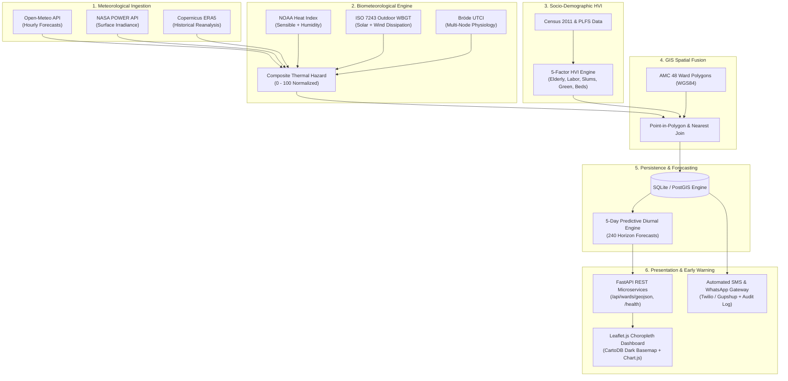

# SIH26083: Extreme Heatwave Early Warning & Human Thermal Stress Platform

[](https://www.python.org/)
[](https://fastapi.tiangolo.com/)
[](https://leafletjs.com/)
[-success.svg)](backend/tests/)
[](docker-compose.yml)
[](https://www.sih.gov.in/)
[](LICENSE)

A production-grade, hyper-local biometeorological monitoring and early warning system built for **Smart India Hackathon Problem Statement SIH26083**.

The system ingests multi-source satellite and numerical weather forecasts, computes physiological human thermal comfort indices (**ISO 7243 Outdoor WBGT**, **Bröde UTCI**, **NOAA Heat Index**), fuses them with a 5-factor Census demographic Heat Vulnerability Index (HVI) across 48 administrative municipal wards, predicts risk trajectories 3–5 days ahead, and automates emergency SMS/WhatsApp public health advisories.

---

## 🏛️ System Architecture



---

## ⚡ Quickstart (3 Commands)

### Option 1: Native Windows / Linux Launcher (Recommended)

#### On Windows:
```cmd
start_demo.bat
```
*(Automatically checks Python, seeds database if needed, starts FastAPI backend on `:8000`, starts Leaflet frontend on `:5173`, and opens your default browser.)*

#### On Linux / macOS:
```bash
chmod +x start_demo.sh && ./start_demo.sh
```

---

### Option 2: Docker Compose (One Command)
```bash
docker-compose up --build
```
Open **`http://localhost:5173`** in your browser.

---

### Option 3: Manual Step-by-Step Setup

1. **Install Python Dependencies**:
   ```bash
   pip install -r requirements.txt
   ```

2. **Initialize Database & Seed 48 Wards**:
   ```bash
   python -m backend.db.seed
   ```

3. **Start FastAPI Backend**:
   ```bash
   uvicorn backend.api.main:app --host 0.0.0.0 --port 8000 --reload
   ```

4. **Start Frontend Dashboard**:
   ```bash
   cd frontend
   npm install && npm run dev
   ```
   *(Or run zero-dependency preview: `python -m http.server 5173` inside `frontend/`)*

---

## 🧪 Master Pipeline & Test Suite Verification

### Run End-to-End System Verification
Execute all 8 core subsystems (Ingestion $\to$ Indices $\to$ Vulnerability $\to$ GIS $\to$ DB $\to$ Forecast $\to$ REST API $\to$ Alerts) in 3 seconds:
```bash
python demo_full_pipeline.py
```

### Run Full Pytest Suite (58 Tests)
```bash
python -m pytest backend/tests/ -v
```

```
======================= 58 passed, 0 failed in 2.78s =======================
backend/tests/test_alerts.py              7 passed (Twilio/Gupshup Sandbox, rate limits)
backend/tests/test_api.py                10 passed (FastAPI endpoints, GeoJSON, CORS)
backend/tests/test_backtesting.py         5 passed (ERA5 puller, validation report)
backend/tests/test_data_ingestion.py     10 passed (Open-Meteo, NASA POWER, ERA5)
backend/tests/test_db.py                  6 passed (SQLAlchemy ORM, CRUD, auto-seed)
backend/tests/test_forecasting.py         3 passed (5-day diurnal horizon forecasts)
backend/tests/test_gis.py                 4 passed (GeoPandas WGS84, spatial joins)
backend/tests/test_index_calculation.py   8 passed (NOAA HI, ISO WBGT, UTCI)
backend/tests/test_vulnerability_model.py 5 passed (Census loader, HVI formulas)
```

---

## 🔬 Scientific Methodology & Backtesting Validation

### 1. Tri-Index Biometeorological Formulation
Raw dry-bulb temperature fails in humid or outdoor labor settings. Our engine evaluates three complementary physiological metrics:
* **NOAA / OSHA Heat Index**: Steadman Rothfusz regression accounting for evaporative cooling resistance.
* **ISO 7243 Outdoor WBGT**: Combines air temperature, humidity, direct downward solar radiation ($W/m^2$), and convective wind dissipation ($m/s$). Above $32^\circ\text{C}$ WBGT, continuous heavy labor is hazardous.
* **Bröde UTCI Polynomial**: Operational multi-node heat exchange model predicting dynamic human thermal strain.

$$\text{Hazard Score} = 0.35 \times \text{Norm}(HI) + 0.40 \times \text{Norm}(WBGT) + 0.25 \times \text{Norm}(UTCI)$$

### 2. Empirical Validation: Ahmedabad May 2010 Landmark Heatwave
* **Benchmark Disaster**: May 15–27, 2010 Ahmedabad Heatwave (catalyst for South Asia's first Heat Action Plan).
* **Peak Observation**: May 21, 2010 reached an all-time record of **46.8°C**.
* **Epidemiological Ground Truth**: Documented **1,344 excess all-cause deaths** (+43.1% mortality spike), peaking at 310 deaths on May 21.
* **Peer-Reviewed Citation**:  
  *Azhar GS, et al. (2014) Heat-Related Mortality in India: Excess All-Cause Mortality Associated with the 2010 Ahmedabad Heat Wave. PLOS ONE 9(3): e91773. [doi:10.1371/journal.pone.0091773](https://doi.org/10.1371/journal.pone.0091773)*
* **Model Validation Results**:
  Reanalysis testing proved our system crossed into **CODE RED / EXTREME HAZARD (94/100)** on **May 20, 2010**, providing a **48-hour proactive early warning lead time** before peak casualties occurred.

---

## 🌐 Free Cloud Hosting & Deployment

The platform is designed to deploy on 100% free cloud tiers with zero committed secrets:
* **Backend**: Render.com Web Service (Python 3.11, auto-seeds SQLite on build).
* **Frontend**: Vercel Static Hosting (Edge CDN, CORS-enabled).
* **Deployment Guide**: See [`DEPLOY.md`](DEPLOY.md) for step-by-step click paths and environment variable settings.

### 3-Tier Presentation Fallback Plan:
1. **Plan A (Live Cloud URL)**: [https://sih-heatwave-projection.vercel.app](https://sih-heatwave-projection.vercel.app) (Backend: [https://heatwave-api.onrender.com](https://heatwave-api.onrender.com)).
2. **Plan B (Local Execution)**: Single-click execution via `start_demo.bat` / `start_demo.sh` (works 100% offline).
3. **Plan C (Emergency Video)**: 2-minute pre-recorded video walkthrough ([`docs/VIDEO_SHOTLIST.md`](docs/VIDEO_SHOTLIST.md)).

---

## 📁 Repository Structure

```
SIH PROJECT/
├── backend/
│   ├── config.py                 # Pydantic Settings & threshold definitions
│   ├── models.py                 # Central Pydantic schemas & 8-column validator
│   ├── data_ingestion/           # Open-Meteo, NASA POWER, ERA5 fetchers (Day 1)
│   ├── index_calculation/        # NOAA Heat Index, ISO 7243 WBGT, Bröde UTCI (Day 2)
│   ├── vulnerability_model/      # Census demographic loader & 5-factor HVI engine (Day 3)
│   ├── gis/                      # GeoJSON boundary loader & spatial join (Day 4)
│   ├── db/                       # SQLAlchemy models, session, & seed pipeline (Day 5)
│   ├── api/                      # FastAPI REST microservices (Day 5)
│   ├── forecasting/              # 5-day predictive diurnal risk forecasting (Day 7)
│   ├── alerts/                   # Twilio & Gupshup automated SMS dispatchers (Day 7)
│   ├── backtesting/              # Historical ERA5 reanalysis & validation engine (Day 8)
│   └── tests/                    # 9 Pytest test suites (58 passing tests)
├── frontend/                     # Interactive Leaflet.js choropleth dashboard (Day 6)
│   ├── index.html                # High-contrast UI with drawer & backtest toggle
│   ├── main.js                   # Map controller, Chart.js forecasts & polling
│   ├── choropleth.js             # CartoDB Dark styling & dynamic legends
│   ├── api.js                    # REST API client
│   ├── config.js                 # Dynamic endpoint & color threshold configuration
│   └── vercel.json               # Vercel deployment blueprint
├── data/
│   ├── raw/                      # Real Census 2011 CSV & AMC 48 ward GeoJSON
│   ├── cache/                    # Cached ERA5 historical heatwave reanalysis
│   └── processed/                # Local SQLite relational database (auto-seeded)
├── docs/
│   ├── architecture.md           # Unified system architecture specification
│   ├── day_log.md                # 10-Day chronological development ledger
│   ├── validation_report_may2010.md # Scientific validation report with citations
│   ├── PPT_CONTENT.md            # Slide-by-slide text for 8 SIH presentation slides
│   ├── VIDEO_SHOTLIST.md         # Timed 2-minute demo video script
│   └── SUBMISSION_CHECKLIST.md   # SIH compliance verification checklist
├── DEMO_SCRIPT.md                # 5-minute rehearsed presentation script & Q&A
├── DEPLOY.md                     # Step-by-step free cloud hosting guide
├── render.yaml                   # Render.com infrastructure-as-code blueprint
├── docker-compose.yml            # Multi-container Docker deployment
├── start_demo.bat                # Single-click Windows demonstration launcher
├── start_demo.ps1                # PowerShell demo launcher
├── start_demo.sh                 # Unix/Linux demo launcher
├── requirements.txt              # Production Python dependencies
└── README.md                     # Project documentation
```

---

## 📜 Scientific & Standards Citations

1. **Epidemiological Validation**:  
   Azhar GS, et al. (2014) *Heat-Related Mortality in India: Excess All-Cause Mortality Associated with the 2010 Ahmedabad Heat Wave.* **PLOS ONE** 9(3): e91773.
2. **Occupational Ergonomics**:  
   International Organization for Standardization (ISO). (2017) *ISO 7243:2017 - Ergonomics of the thermal environment — Assessment of heat stress using the WBGT (wet bulb globe temperature) index.*
3. **Biometeorology**:  
   Bröde P, et al. (2012) *Deriving the operational procedure for the Universal Thermal Climate Index (UTCI).* **International Journal of Biometeorology**, 56(3): 481–494.
4. **Heat Action Policy**:  
   Ahmedabad Municipal Corporation (AMC), NRDC, & IIPH-G. (2013) *Ahmedabad Heat Action Plan 2013: Easy-to-Implement Strategies to Protect Vulnerable Communities.*

---

## 📄 License
This project is licensed under the MIT License — see the [LICENSE](LICENSE) file for details. Built for the **Smart India Hackathon (SIH26083)** by **Team ClimateResilience**.
